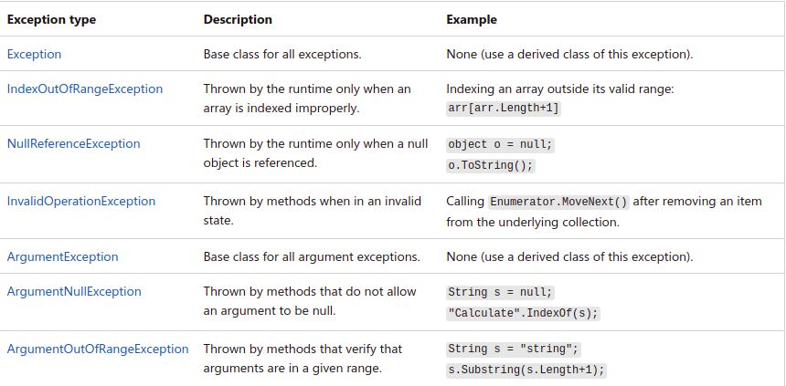

# Reading Exception Handling

### Exception Handling:
> An exception is defined as an event that occurs during the execution of a program that is unexpected by the program code

| # | Description |
| ----------- | ----------- |
| try |This block holds the code that may throw an exception. |
| catch |This block catches the exception thrown by the try block. |
| finally |This block holds the default code. |

### Common Exceptions Type [1]
 

### Debugging
>  it means removing bugs from your code. 
> - debugger actively monitors everything that’s happening as the program runs.
> - can pause the app at any point to examine its state.

To start Debugging  
1) F5 OR 
the Debug > Start Debugging menu command or the Start Debugging button Start Debugging in the Debug Toolbar
2) Set a breakpoint by clicking in the left margin next to a line of code. OR 
place the cursor on a line and press F9.
### Therac-25
The Therac-25 was a computer-controlled radiation therapy machine produced by Atomic Energy of Canada Limited (AECL) in 1982. It was involved in at least six accidents between 1985 and 1987, in which patients were given massive overdoses of radiation. These accidents highlighted the dangers of software control of safety-critical systems, and have become a standard case study in health informatics and computer ethics. Software faults in the Therac-25 X-ray scanner led to six accidents in which patients were exposed to potentially lethal doses of radiation. In three cases, the injured patients later died as a result of radiation overdose; the fault was attributed to poor software design and development practices rather than single-out specific coding errors. AECL did not have the software code independently reviewed and chose to rely on in-house code, including the operating system.

### Ariane 5
Ariane 5 is a European heavy-lift space launch vehicle operated by Arianespace for the European Space Agency (ESA). It has been used to deliver payloads into geostationary transfer orbit (GTO) or low Earth orbit (LEO). The launch vehicle had a streak of 82 consecutive successful launches between 9 April 2003 and 12 December 2017. Ariane 5 has been refined in successive versions: "G", "G+", "GS", "ECA", and most recently, "ES".

#### Resources
[1 Microsoft](https://docs.microsoft.com/en-us/dotnet/standard/exceptions/)  

