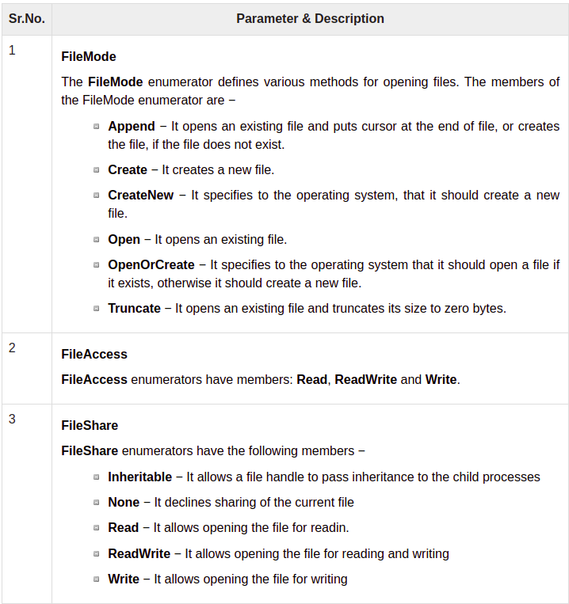

# File Manipulation / System.IO

A file is a collection of data stored in a disk with a specific name and a directory path. When a file is opened for reading or writing, it becomes a stream.

The stream is basically the sequence of bytes passing through the communication path. 

### There are two main streams: 
- the input stream 
- the output stream. 

> The input stream is used for reading data from file and the output stream is used for writing into the file.

## The following table shows some commonly used classes in the System.IO namespace:

| |I/O Class| Description|
|-|---------|-----------|
|01|BinaryReader|Reads primitive data from a binary stream.|
|02|BinaryWriter  |Writes primitive data in binary format. |
|03|BufferedStream|A temporary storage for a stream of bytes. |
|04|Directory  |Helps in manipulating a directory structure. |
|05|DirectoryInfo |Used for performing operations on directories. |
|06|File  |Helps in manipulating files. |
|07|FileInfo  |Used for performing operations on files. |
|08|FileStream  |Used to read from and write to any location in a file. |
|09|MemoryStream  |Used for random access to streamed data stored in memory. |
|10|Path  |Performs operations on path information. |
|11|StreamReader |Used for reading characters from a byte stream. |
|12|StreamWriter  |Is used for writing characters to a stream. |
|13|StringReader  |Is used for reading from a string buffer. |
|14|StringWriter  |Is used for reading into a string buffer.|

### The FileStream Class [1]
> The FileStream class in the System.IO namespace helps in reading from, writing to and closing files. This class derives from the abstract class Stream.

### Compression & Decompression
> Compression is reducing the size of a file for storage. Decompression is the process of extracting the contents of a compressed file so they are in a usable format. 

### Isolated storage
> Isolated storage is a data storage mechanism that provides isolation and safety by defining standardized ways of associating code with saved data.

### Create Directory using VS 
1. using systm.IO
2. Directory.CreateDirectory(NameDir);

> if you want delete 
>> Directory.Delete(NameDir);

### Write inside file 
> 1. StreamWriter sw = new StreamWriter ("NameFile");
> 2. sw.WriteLine("any Text");
> 3. sw.Close();

### Read from file 
> 1. StramReader sr = new StreamReader("myFile");
> 2. string str = sr.ReadToEnd();

#### Reference
1 [Tutorialspoint](https://www.tutorialspoint.com/csharp/csharp_file_io.htm#:~:text=A%20file%20is%20a%20collection,stream%20and%20the%20output%20stream.) 