# Introduction to SQL
 >  - SQL stands for Structured Query Language
 >  - SQL lets you access and manipulate databases (e.g 
>> - SQL can create new databases
>> - SQL can create new tables in a database
>> - SQL can insert in a database
>> - SQL can update in a database
>> - SQL can delete from a database
>> - SQL can retrieve data from a database   (etc ...))

### Some of The Most Important SQL Commands
1. SELECT - extracts data from a database
2. UPDATE - updates data in a database
3. DELETE - deletes data from a database
4. INSERT INTO - inserts new data into a database
5. CREATE DATABASE - creates a new database
6. CREATE TABLE - creates a new table
7. DROP TABLE - deletes a table

### SQL SELECT 
> The SELECT statement is used to select data from a database.
> #### Exercise 1
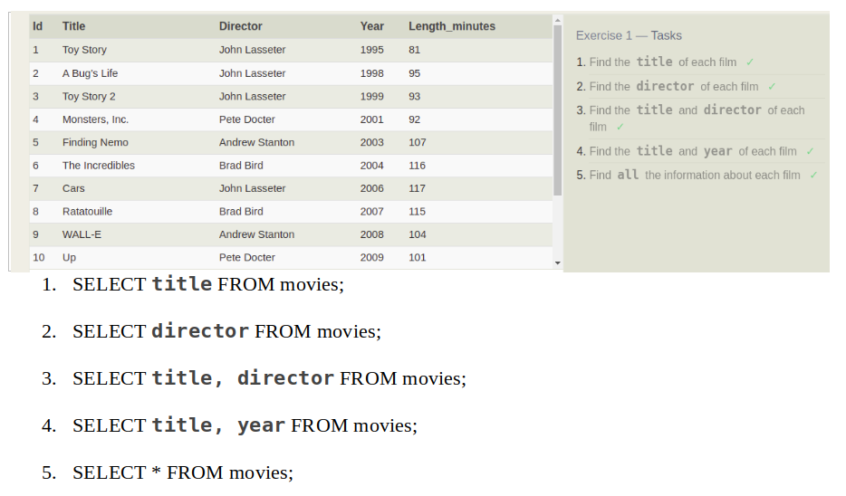

### SQL WHERE 
> The SQL WHERE clause is used to specify a condition while fetching the data from a single table.
>> - DISTINCT keyword will blindly remove duplicate rows.
>> - The ORDER BY keyword is used to sort the result-set in ascending or descending order.

> #### Exercise 2
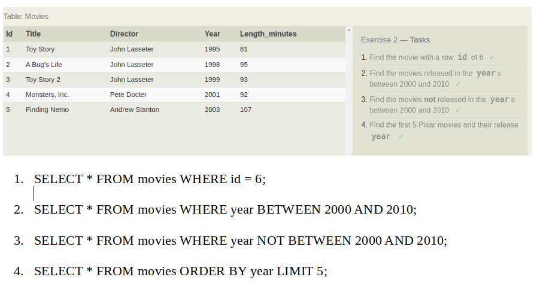
> #### Exercise 3
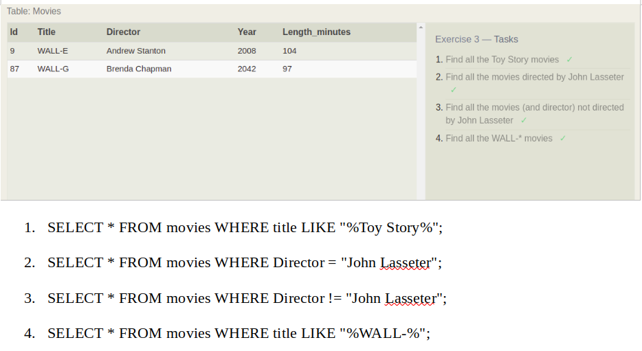
> #### Exercise 4
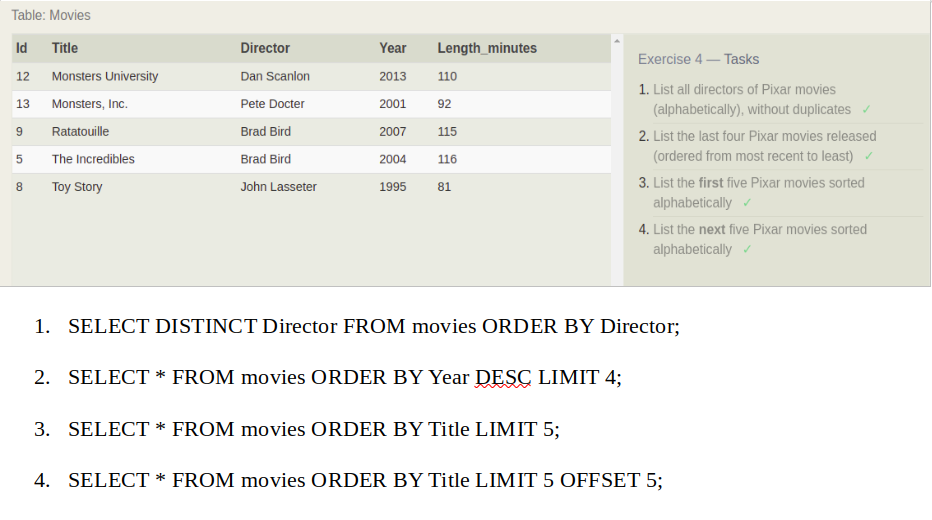
> #### Review 1
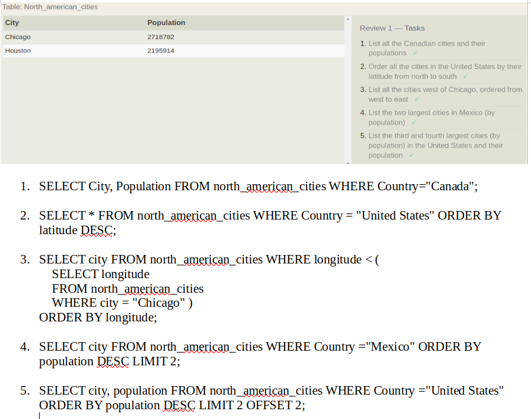

### INNER JOIN
> The INNER JOIN keyword selects data that have matching values in both tables.
> #### Exercise 6
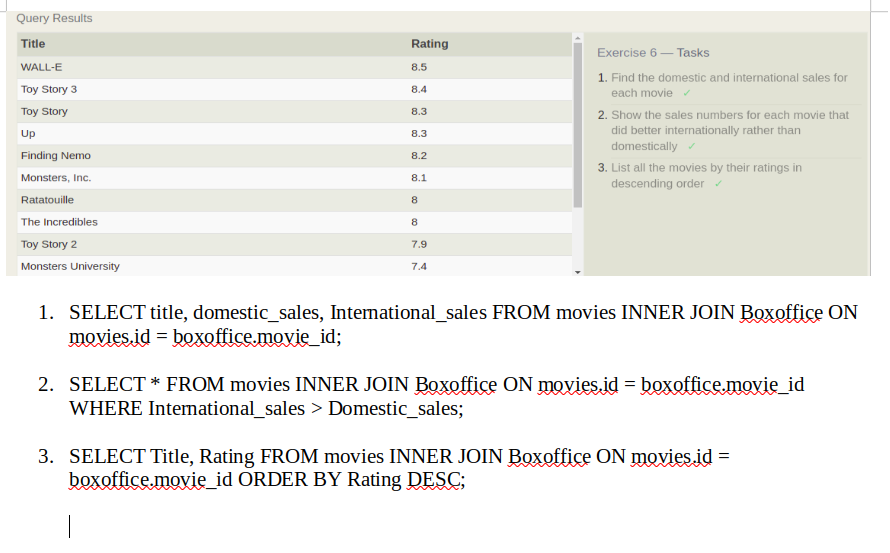

### INSERT INTO
> The INSERT INTO statement is used to insert new data in a table.
> #### Exercise 13
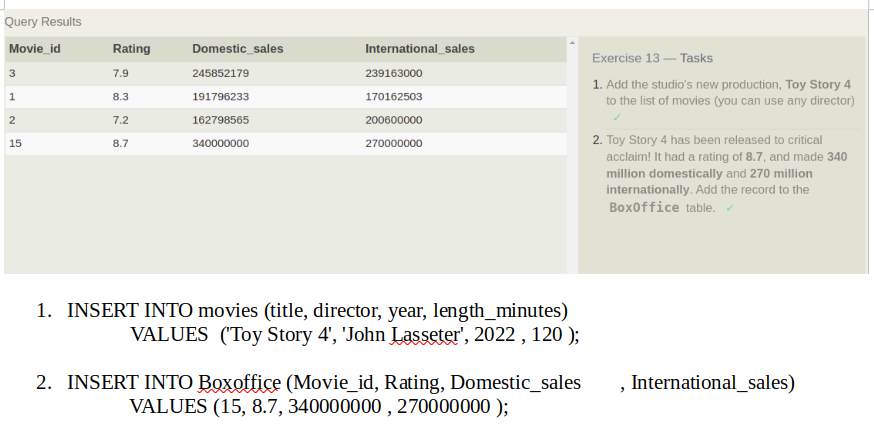
### UPDATE 
> The INSERT INTO statement is used to insert new data in a table.
> #### Exercise 14
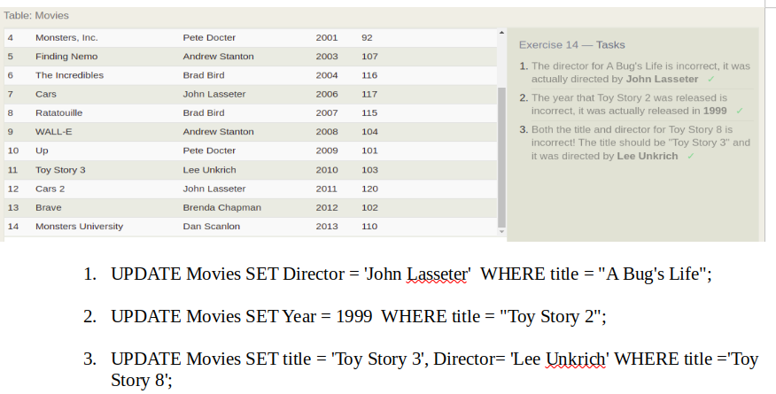

### DELETE 
> The INSERT INTO statement is used to insert new data in a table.
> #### Exercise 15
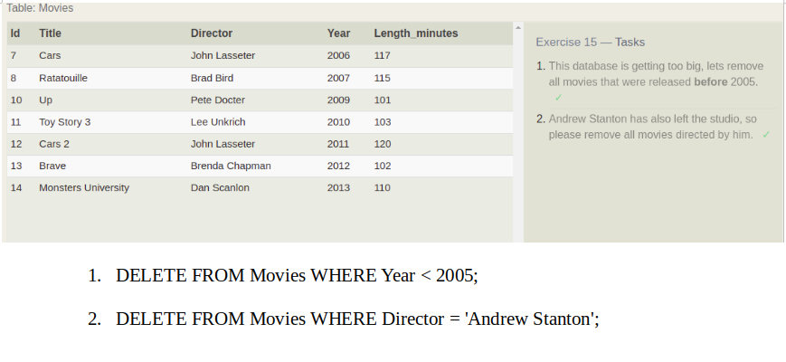

### CREATE TABLE 
>The CREATE TABLE statement is used to create a new table in a database.
>> #### Exercise 16
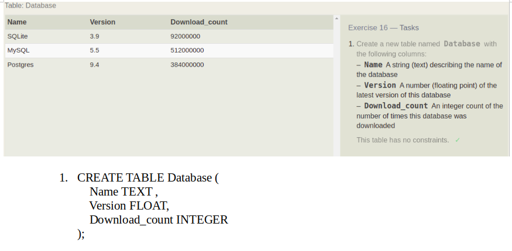

### ALTER TABLE 
> The ALTER TABLE statement is used to add, delete, or modify columns in an existing table. and also used to add and drop various constraints on an existing table.
>> #### Exercise 17

### DROP TABLE 
>The DROP TABLE statement is used to drop an existing table in a database.
>> #### Exercise 18
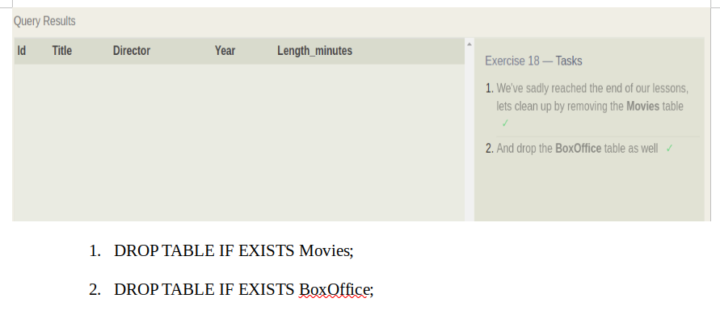
