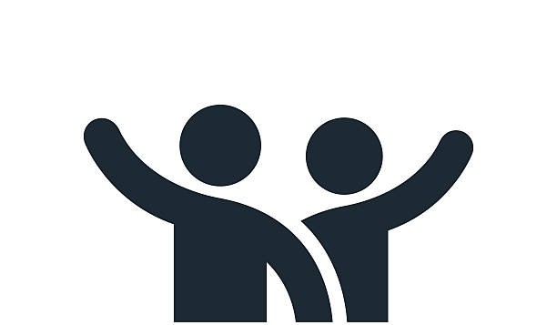

# Reading Notes
## This note contains all of the concepts and topics that I will learn. ^_^

| Prep | URL |
| ----------- | ----------- |
| What is SQL |[SQL](IntroductiontoSQL/IntroductionToSQL.md)|
| Practice In The TerminalL | [Practice In The Terminal](PracticeInTheTerminal/PracticeInTheTerminal.md)|
| What is Mindsets |[Mindsets](Mindsets.md)|
 

# - Code 102 - Intro to Software Development
# - Code 201 - Foundations of Software Development
# - Code 301 - Intermediate Software Development
# - Code 401 - Advanced Software Development
## Week 01
- [Reading 01 Exception Handling](ExceptionHandling/ExceptionHandling.md)
- [Reading 02 Unit Testing and Documentation](UnitTestingandDocumentation/UnitTestingandDocumentation.md)
- [Reading 03 System.IO](FileManipulation_System_IO/system.md)
- [Reading 04 Classes and Objects](Classes_Objects/Classes_Objects.md)

