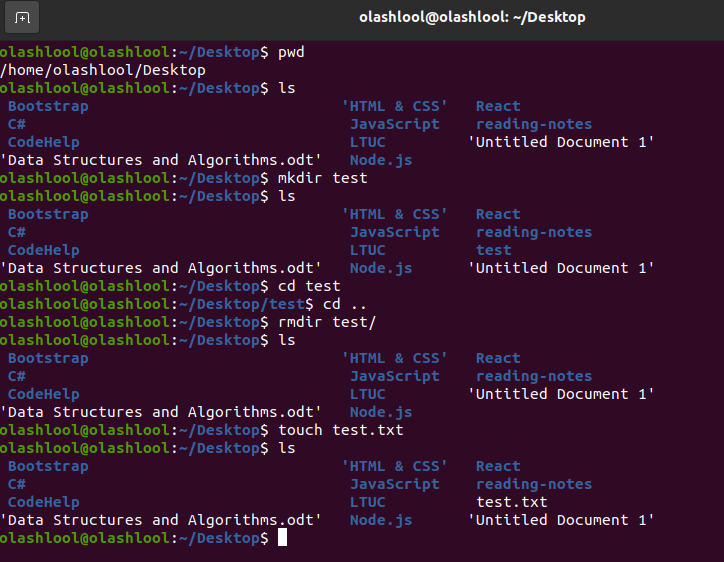

# Reading Practice in the Terminal

###### The Command Line: is a user interface that's navigated by typing commands at prompts, instead of using a mouse

### Some of the most important commands:

| Command Line | Description |
| ----------- | ----------- |
| pwd |it will print your currnet directory path |
| ls | it will list the content of the currnet directory , both folders and files with the extintions. |
| cd | Change Directories |
| mkdir | to make a new directory |
| rmdir | will remove the newdir directory |
| touch | will creat a new file |
| cp | will copy the file or foldec |
| mv | will move the file or folder |
| file | obtain information about what type of file a file or directory is.
 |

### Manual pages:
> it is a help cheat to search for a command To call it man -k /search inside the current manual page n next found item after search command